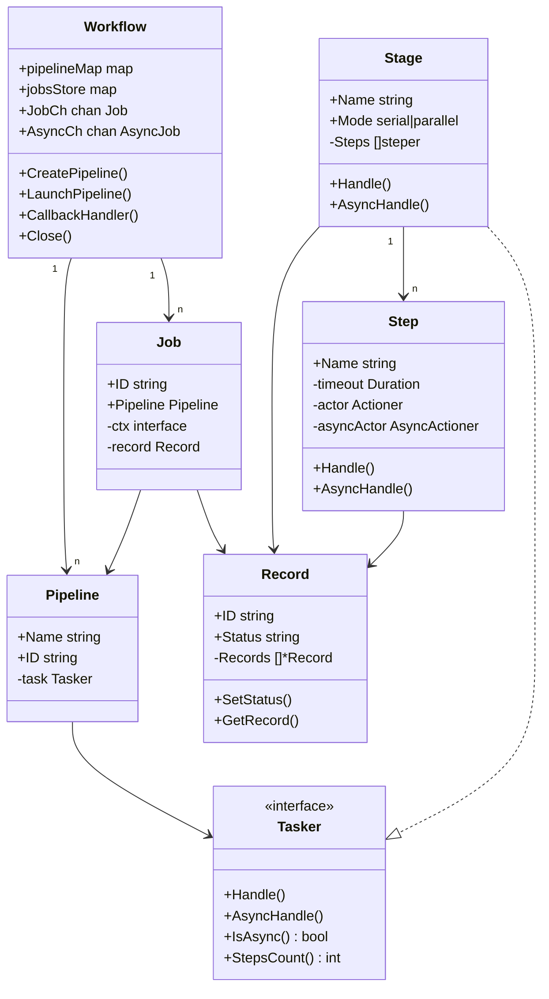
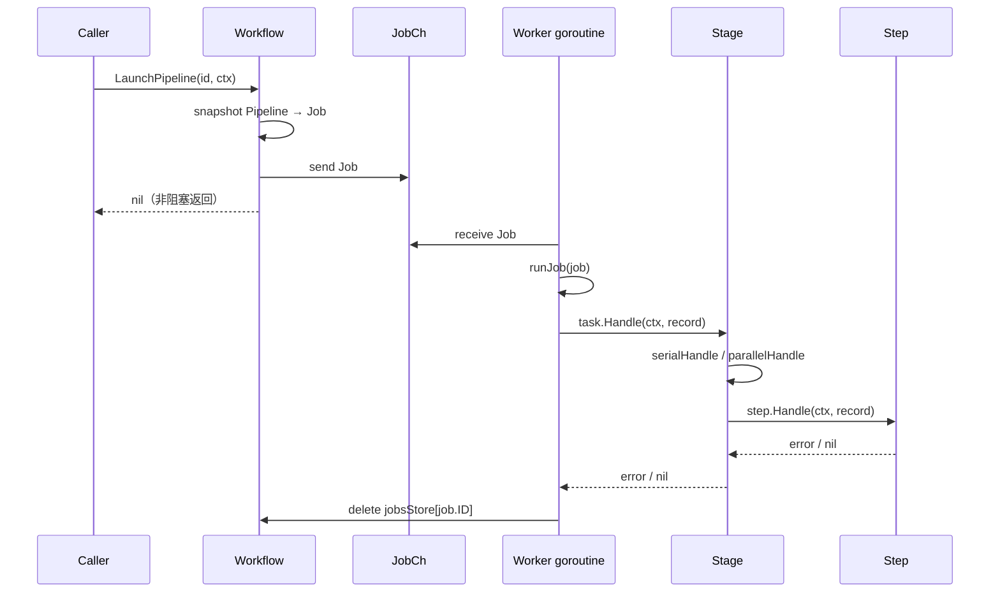
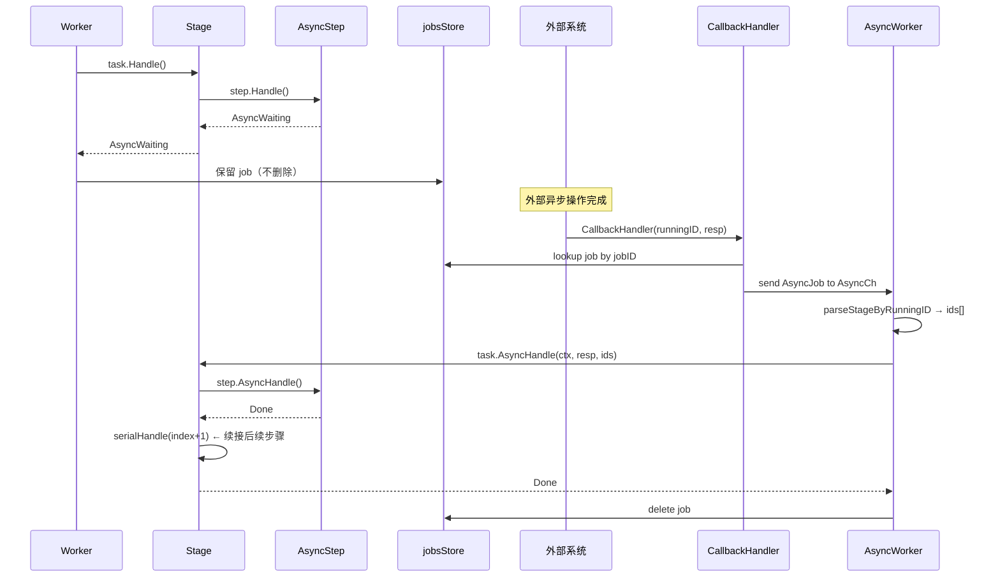
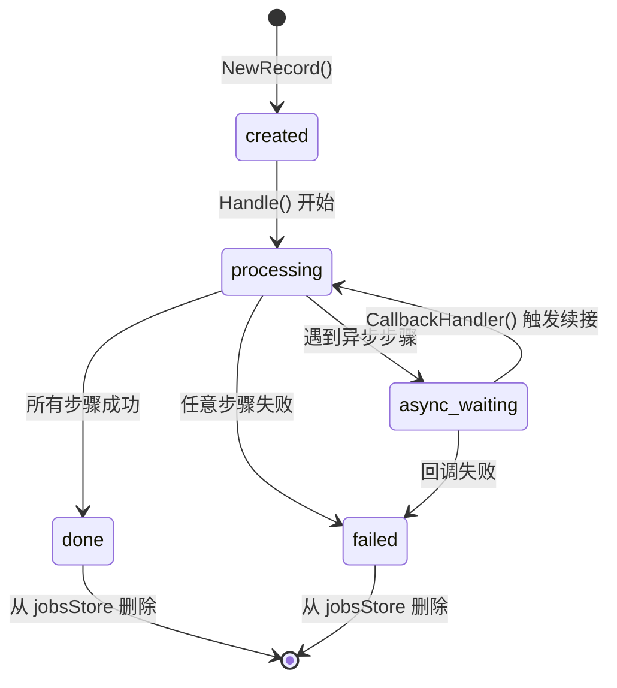

# Workflow 代码架构分析

> 整理自 code review 讨论，2026-04-04

---

## 工程结构

代码分 5 个包，职责分明：

```
workflow/           ← 调度层（Workflow + Pipeline/Job 管理）
├── logger/         ← 基础设施层（日志抽象）
├── record/         ← 状态层（执行状态树）
├── stage/          ← 编排层（串行/并行组合节点）
└── step/           ← 执行层（叶节点，真正干活）
```

依赖方向单向向下，无循环依赖。

---

## 核心数据模型

本质是一棵**执行树**：

```
Pipeline（任务模板）
  └── Tasker（接口）
        └── Stage（组合节点，serial / parallel）
              ├── Step（叶节点，sync / async）
              └── Stage（可嵌套）
                    └── Step
```

运行时实例化为 Job + Record 树，结构一一对应：

```
Job
  └── record.Record（根节点）
        ├── Record（stage 0）
        │     ├── Record（step 0）
        │     └── Record（step 1）
        └── Record（stage 1）
              └── Record（step 0）
```

Record ID 用层次字符串编码路径（如 `abc123-0-1`），是异步回调"找回自己位置"的关键。

---

## 并发调度模型

```
LaunchPipeline ──────► JobCh (buffered chan)
                              │
                    ┌─────────┴──────────┐
                 Worker-0           Worker-N    ← workerNum 个 goroutine
                    │
                 runJob()
                    │
              task.Handle()
                    │
             ┌──────┴──────┐
          Done/Failed   AsyncWaiting
             │               │
          clean up       留在 jobsStore
                              │
CallbackHandler ──► AsyncCh (buffered chan)
                              │
                    ┌─────────┴──────────┐
                AsyncWorker-0       AsyncWorker-N
                    │
                runAsyncJob()
                    │
            task.AsyncHandle()
                    │
             ┌──────┴──────┐
          Done/Failed   AsyncWaiting（等下一次回调）
```

---

## 图1：组件关系（静态结构）



---

## 图2：同步执行时序



---

## 图3：异步执行时序（最复杂的部分）



---

## 图4：Job 状态机



---

## 设计评价

### 合理之处

- **Composite 模式**：Tasker 接口使 Stage 可以无限嵌套，扩展性好
- **结构对称**：Record 树和执行树结构对应，状态追踪清晰
- **关闭语义**：`for range channel` + `closeOnce` 保证排水（修复后）
- **零外部依赖**：纯标准库，部署简单

### 如果重新设计，会改变两件事

**1. 异步续接机制（C5 架构债务）**

现在 `serialAsyncHandle` 内联调用 `serialHandle`，后续同步工作压在 async worker 上。
更好的设计：回调处理完后，把 job 加上"从哪里继续"的游标，重新投入 `JobCh`。

```
AsyncWorker: 只处理回调结果，更新 Record 状态
     ↓ 如果还有后续步骤
→ 把 Job + nextIndex 投入 JobCh
     ↓
JobWorker: 从 nextIndex 继续 serialHandle
```

**2. 引入 `context.Context` 替换 `ctx interface{}`**

现在 ctx 是业务参数，不是控制参数。引入 `context.Context` 后：
- Job 天然支持超时和取消
- 不需要额外的 CancelJob 接口
- 取消信号可以传递到 Step 里的 `Actioner`

---

## 阅读建议

| 目的 | 先看哪张图 |
|---|---|
| 快速理解整体 | 图1（组件关系） |
| 理解执行流程 | 图2（同步时序） |
| 理解异步机制 | 图3（异步时序） |
| 理解状态流转 | 图4（状态机） |
